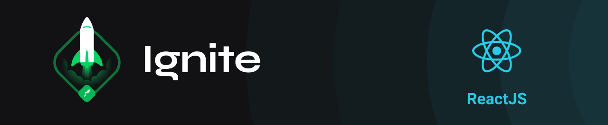

<h1 align="center">
  Ignite - Trilha ReactJS
</h1>

## Índice de projetos

- [Github Explorer](https://github.com/felipefrm/ignite-reactjs/tree/master/01-github-explorer)
- [dt money](https://github.com/felipefrm/ignite-reactjs/tree/master/02-dt-money)
- [ig.news](https://github.com/felipefrm/ignite-reactjs/tree/master/03-ignews)
- [dashgo](https://github.com/felipefrm/ignite-reactjs/tree/master/04-dashgo)
- [Next Auth](https://github.com/felipefrm/ignite-reactjs/tree/master/05-next-auth)
- [React Performance](https://github.com/felipefrm/ignite-reactjs/tree/master/06-react-performance)

## Índice de desafios

### Capítulo I

- [Desafio 01 - Conceitos do React](https://github.com/felipefrm/ignite-reactjs/tree/master/challenges/01-to.do)
- [Desafio 02 - Componentizando a aplicação](https://github.com/felipefrm/ignite-reactjs/tree/master/challenges/02-WatchMe)

### Capítulo II

- [Desafio 01 - Criando um hook de carrinho de compras](https://github.com/felipefrm/ignite-reactjs/tree/master/challenges/03-Rocketshoes)
- [Desafio 02 - Refactoring de classes e TypeScript](https://github.com/felipefrm/ignite-reactjs/tree/master/challenges/04-GoRestaurant)

### Capítulo III

- [Desafio 01 - Criando uma aplicação do zero](https://github.com/felipefrm/ignite-reactjs/tree/master/challenges/05-spacetraveling)
- [Desafio 02 - Adicionando features ao blog](https://github.com/felipefrm/ignite-reactjs/tree/master/challenges/05-spacetraveling)

### Capítulo IV

- [Desafio 01 - Interface com Chakra UI](https://github.com/felipefrm/ignite-reactjs/tree/master/challenges/06-worldtrip)
- [Desafio 02 - Upload de imagens](https://github.com/felipefrm/ignite-reactjs/tree/master/challenges/07-upfi)

### Capítulo V

- [Desafio 01 - Otimizando a aplicação](https://github.com/felipefrm/ignite-reactjs/tree/master/challenges/02-WatchMe)